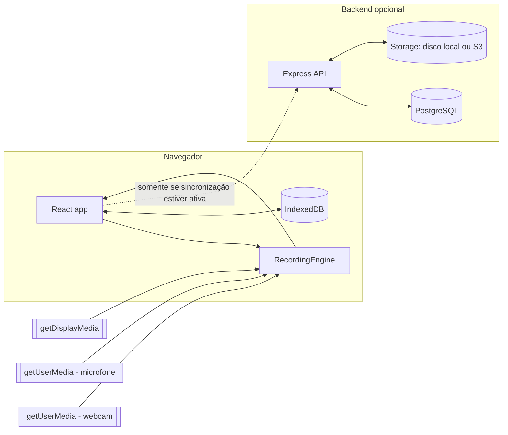
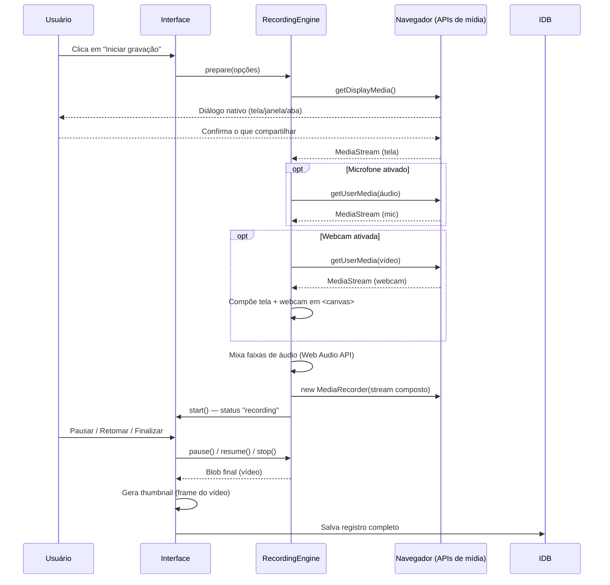
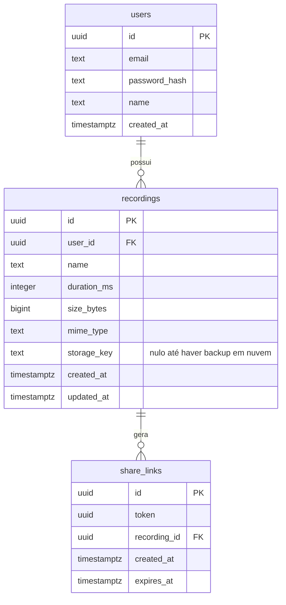

# Arquitetura — Gravador de Tela

Este documento detalha como as peças do projeto se conectam. Para instalação e uso, veja o [README](./README.md).

### Visão geral

O vídeo gravado **nunca** trafega para o backend a menos que o usuário ative explicitamente a sincronização/backup em nuvem — e mesmo assim, o que trafega é o arquivo já finalizado, não um stream ao vivo da tela.

### Fluxo de gravação (cliente)

### Modelo de dados (backend)

